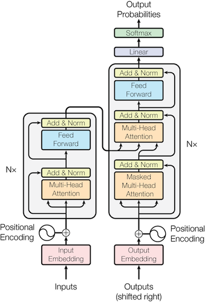

# 从零开始搭建GPT-2（124M）

## GPT-2的初始化
因为OpneAI发布的gpt2源代码使用的tensorflow框架，我们会使用pytorch，使用Huggingface提供的转化过的权重参数。

搬出下面这张图镇楼，作为一切的一切的起点，我们将围绕这张图来搭建gpt2（下面统称gpt2）的模型框架。


首先gpt2没有图的左边这一部分，包括接入的交叉注意力头，并且根据gpt2的官方文档有两个变动点：1. 交换了归一化层的位置 2. 在最后的自注意力块后面又添加了一个新的归一化层。

gpt2的一些配置信息：
```
block_size: int = 1024 # 最大序列长度
  vocab_size: int = 50257 # 词汇表大小 50000 + 256 + 1
  n_layer: int = 12
  n_head: int = 12
  n_embd: int = 768 # 嵌入维度
```
开始搭建框架：
```
self.transformer = nn.ModuleDict(dict(
    wte = nn.Embedding(config.vocab_size, config.n_embd), # 对应图中的Output Embedding
    wpe = nn.Embedding(config.block_size, config.n_embd), # 对应图中的Positional Embedding
    h = nn.ModuleList([Block(config) for _ in range(config.n_layer)]), # 对应主体的模块
    ln_f = nn.LayerNorm(config.n_embd), # gpt添加的额外的归一化层
        ))
  self.lm_head = nn.Linear(config.n_embd, config.vocab_size, bias=False) # 对应图中的linear
```
在Block块里面的attn()里tokens相互交流信息，而在mlp()里进行信息的消化理解，完成mlp和多头自注意力块后gpt2的雏形就算完成了，接着来加载gpt2的配置信息和参数。

在模型的初始化以及后面的训练中一般是要把模型移到gpu训练的，但就算没有gpu也可以跟随着步骤走一段路，下面的代码可以用来自动检测设备：
```
device = 'cpu'
  if torch.cuda.is_available():
    device = 'cuda'
  elif hasattr(torch.backends, 'mps') and torch.backends.mps.is_available():
    device = 'mps'
  print(f'using device: {device}')
```
要注意的是在模型移到gpu的同时不要忘记张量也是需要移到gpu的，防止张量出现在多个计算设备上面,`buf.to(device)`这种方法是错误的，有漏洞而且不稳定,`buf = buf.to(device)`使用这种方法。

在debug阶段使用的数据集推荐[tiny shakespeare](input.txt)。

gpt2的Tokenizer压缩率在300%左右，比如1000个字符会生成300个token左右。

在处理tokens可以这样做：
```
buf = torch.tensor(tokens[:6 + 1])
  x = buf[:-1].view(2, 3) # input
  y = buf[1:].view(2, 3) # target

  x = ([56, 22, 12],
       [82, 14, 77])
  y = ([22, 12, 82],
       [14, 77, 11])
```
这样x中的每一个token的下一个token就可以在y里面的对应位置找见，并且也解决了x中最后一个token的问题

有了y就可以计算loss了
```
loss = F.cross_entropy(logits.view(-1, logits.size(-1)), targets.view(-1))
```
在初始化阶段的loss我们是希望每一个token有着相似的可能性:`loss = -ln(1/50257) = 10.82 (约)`
```
optimizer = torch.optim.AdamW(model.parameters(), lr=3e-4) # 默认是Adam，建议使用AdamW，修复了一些小bug；
  另外这个初始的学习率在现阶段就可以
  for i in range(50):
    x, y =train_loader.next_batch()
    x, y = x.to(device), y.to(device) # 把x,y张量移动到device计算
    optimizer.zero_grad() # 这里容易忘记
    logits, loss = model(x, y)
    loss.backward()
    optimizer.step()
    print(f'step{i}, loss: {loss.item()}')
```
接下来就可以把数据集分批次送入模型中了，这需要一个数据装入模块，见源码的DataLoaderLite，建议输出的信息包括：
```
print(f'loaded {len(self.tokens)} tokens')  # 总计数据集的token数
  print(f'1 epoch = {len(self.tokens) // (B * T)} batches') # 一次完整的循环要的批次数

  def next_batch(self):
    B, T = self.B, self.T
    buf = self.tokens[self.current_position : self.current_position+B*T+1]
    x = (buf[:-1]).view(B, T) # inputs
    y = (buf[1:]).view(B, T) # targets
    # advance the position in the tensor
    self.current_position += B * T # 更新当前的批次位置
    # if loading the next batch would be out of bounds, advance to next shard
    if self.current_position + (B * T + 1) > len(self.tokens):            
       self.current_position = 0
       return x, y
```
现在我们在不断送入新的批次数据，可这也涵盖不了所有的词汇表token，一些生僻的多语言的token是不会出现在数据集里面的，所以loss应该会下降一些。根据gpt2的官方文档，Token Emdebdding 的权重参数其实和Transformer的最上层的Linear层的权重参数是完全相同一致的，添加：
```
self.transformer.wte.weight = self.lm_head.weight
```
别小看仅仅添加了这一行代码，这行代码帮我们节省了近4百万的训练参数，相当于gpt2模型30%的参数量。

初始化参数：
```
self.apply(self._init_weights)

  def _init_weights(self, module):
    if isinstance(module, nn.Linear):
      std = 0.02
      if hasattr(module, 'NANOGPT_SCALE_INIT'):
        std *= (2 * self.config.n_layer) ** -0.5 # 控制残差层内的激活增长
      torch.nn.init.normal_(module.weight, mean=0.0, std=std)
      if module.bias is not None:
        torch.nn.init.zeros_(module.bias)
    elif isinstance(module, nn.Embedding):
      torch.nn.init.normal_(module.weight, mean=0.0, std=0.02)
```
最后可以设一下种子
```
torch.manual_seed(1337)
  if torch.cuda.is_available():
    torch.cuda.manual_seed(1337)
```
运行，看到下面的输出就说明你已经成功完成gpt2的初始化了
```
using device: mps
  loaded 338025 tokens
  1 epoch = 2640 batches
  step0, loss: 10.960028648376465
  step1, loss: 9.687705993652344
  step2, loss: 9.08289909362793
  ......
  step49, loss: 6.799217224121094
```

## GPT-2的一些基本优化

1. 浮点精度优化（Tensor Cores）

在pythorch框架，张量的默认浮点数类型是float32，每一个浮点数都会占用32位，这其实是比较大的空间占用，对于深度学习方面的训练来说这种程度的精度是没必要的。`torch.set_float32_matmul_precision('high')`设置张量默认为TF32
```
with torch.autocast(device_type=device_type, dtype=torch.bfloat16):
logits, loss = model(x, y) # 设置张量为BF16
```
这并不会把模型里所有的参数都转化为bfloat16或者tfloat32，而是会和float32共存。

2. 引入`torch.compile`

`torch.compile`十分的强大，可以显著减少芯片的读写次数，仅需一行代码就可以大大提高训练速度。
```
model = torch.compile(model) 
```
把模型传给compile后，它会在执行代码前会先总览一遍代码，因此在执行计算时它是会知道接下来的运算的，比如：
```
A * (B + C) / D
```
在开始进行乘法运算时程序就已经知道接下来会进行的加法和除法运算，以及要参加运算的变量。compile会在芯片上保留计算的中间变量，大量超速运算，一次性完成相关变量的所有运算，最后，一次读写把结果返回HBM（相当于GPU的内存）。

3. Flash Attention

`torch.compile`是很强大，但目前有些计算的优化还是遗漏了，这里我们可以使用`Flash Attention`,也是一行代码，更多信息点击[这里](https://arxiv.org/pdf/2205.14135)
```
y = F.scaled_dot_product_attention(q, k, v, is_causal=True) # flash attention
```

4. 替换为‘漂亮数字’

这是一种非常简单粗暴的方法，但总会有意想不到的提升效果。‘漂亮数字’就是12，32，64这种可以被2多次整除的数字，我们可以从头查阅代码，找到‘丑陋数字’用相近的漂亮数字替换，比如gpt2代码里的词汇表大小50257就是一个十分‘丑陋’的数字，就可以用50304来替换。

## GPT-2的进阶优化

1. 超参数，权重归一化，学习率设置

从`GPT-3`的官方文档查找到模型的超参数设置，以及在向后传播后对权重进行归一化，防止开头遇到一批不太好的数据导致模型初始化的损失函数过高，进而导致权重过高影响模型后续的训练。
```
lr=3e-4, betas=(0.9, 0.95), eps=1e-8
norm = torch.nn.utils.clip_grad_norm_(model.parameters(), 1.0)
```
GPT2使用了`cosine衰减`，可以使用pytorch内置函数或者自己实现。
```
def get_lr(it):
(1)linear warmup for warmup_iters steps
if it < warmup_steps:
return max_lr * (it+1) / warmup_steps
(2)if it > lr_decay_iters, return min learning rate
if it > max_steps:
return min_lr
(3)in between, use cosine decay down to min learning rate
decay_ratio = (it - warmup_steps) / (max_steps - warmup_steps)
assert 0 <= decay_ratio <= 1
coeff = 0.5 * (1.0 + math.cos(math.pi * decay_ratio)) # coeff starts at 1 and goes to 0
return min_lr + coeff * (max_lr - min_lr)
```
2. 权重累积

用时间换空间
```
total_batch_size = 524288
B = 16
T = 1024
grad_accum_steps = total_batch_size // (B * T)
```
3. DDP

训练一般运行在多个GPU上，`DDP`就会分配不同批次的数据集到各个GPU，协同交流，大大加速训练。
DDP初始化：
```
ddp = int(os.environ.get('RANK', -1)) != -1 # is this a ddp run?
if ddp:
# use of DDP atm demands CUDA, we set the device appropriately according to rank
assert torch.cuda.is_available(), "for now i think we need CUDA for DDP"
init_process_group(backend='nccl')
ddp_rank = int(os.environ['RANK'])
ddp_local_rank = int(os.environ['LOCAL_RANK'])
ddp_world_size = int(os.environ['WORLD_SIZE'])
device = f'cuda:{ddp_local_rank}'
torch.cuda.set_device(device)
master_process = ddp_rank == 0 # this process will do logging, checkpointing etc.
else:
# vanilla, non-DDP run
ddp_rank = 0
ddp_local_rank = 0
ddp_world_size = 1
master_process = True
# attempt to autodetect device
device = "cpu"
if torch.cuda.is_available():
device = "cuda"
elif hasattr(torch.backends, "mps") and torch.backends.mps.is_available():
device = "mps"
print(f"using device: {device}")
```
4. 训练数据集

GPT-2和3的数据集从未公布过，这里推荐的数据集是[`fineweb`](https://huggingface.co/spaces/HuggingFaceFW/blogpost-fineweb-v1)。

5. 划分数据集，验证损失函数

完成GPT-2的预训练

- [参考](https://www.youtube.com/watch?v=l8pRSuU81PU&t=13698s)

